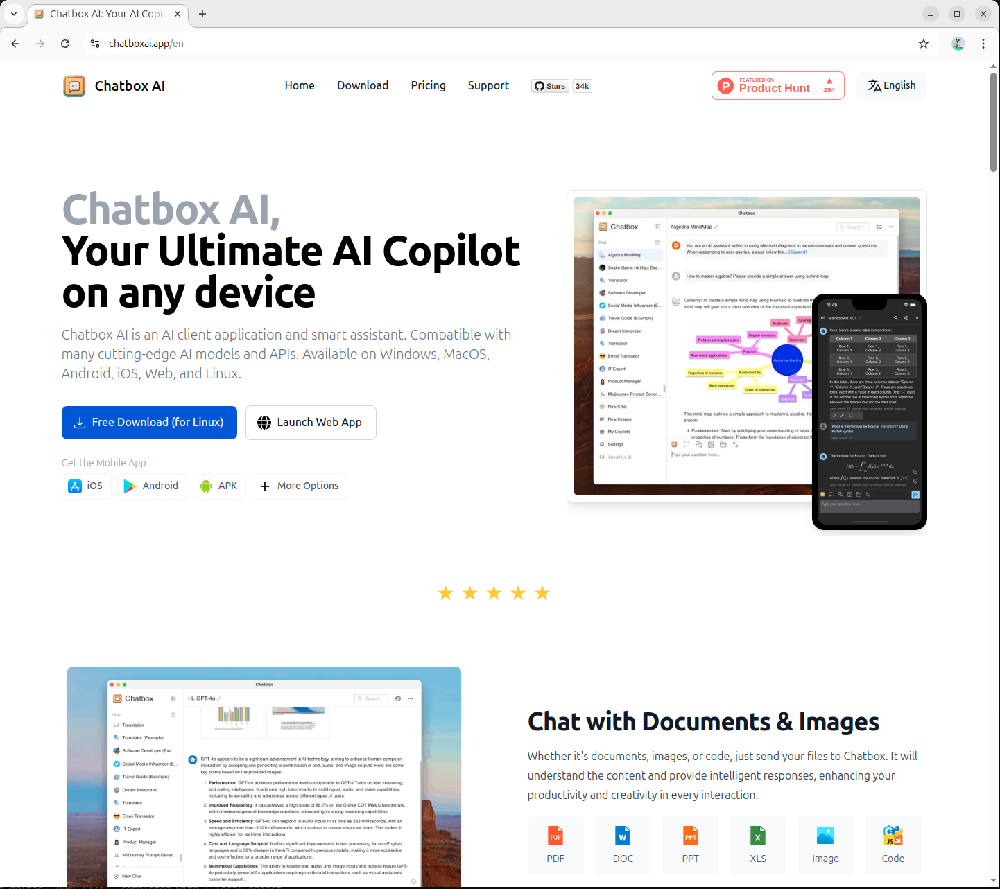
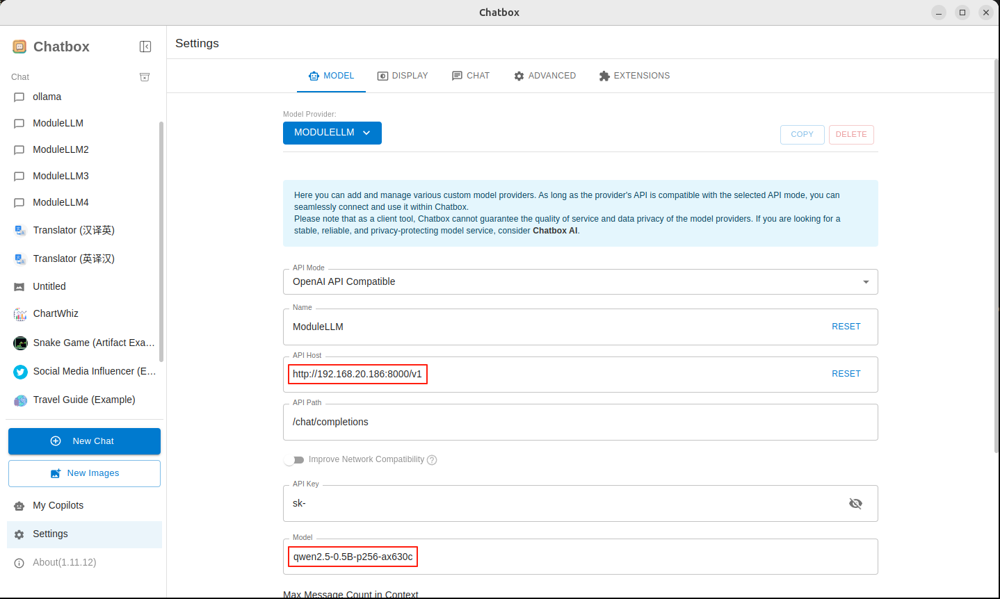
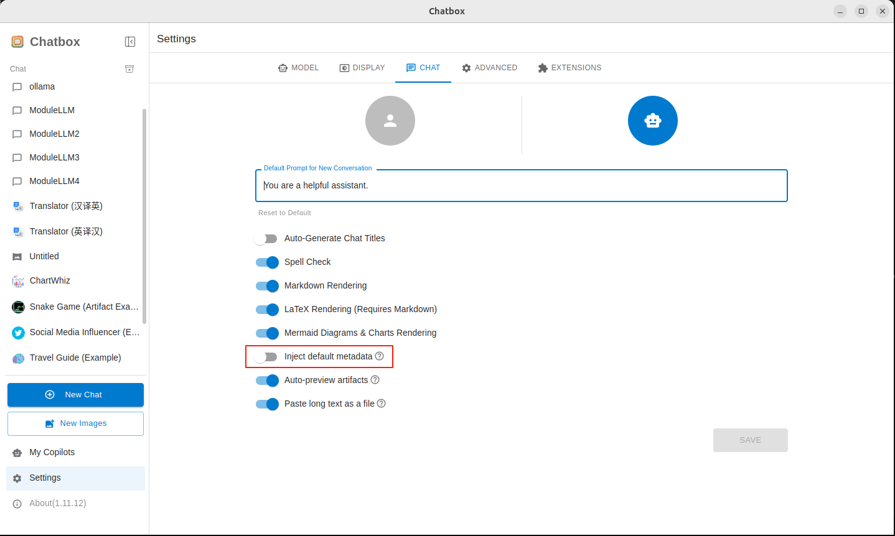
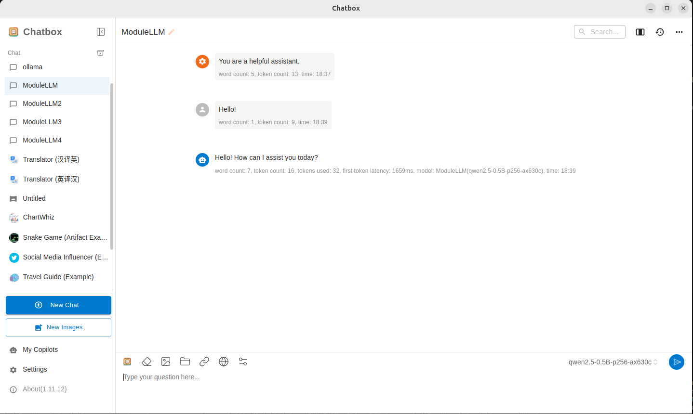
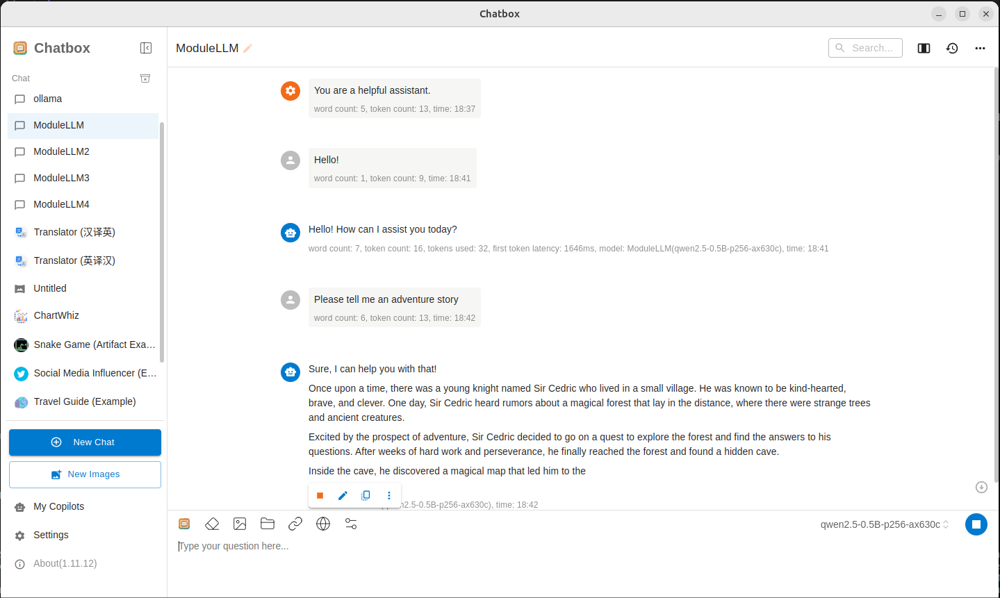

# Update ModuleLLM's package
1. Get the IP address of ModuleLLM via ADB or Serial.
2. ssh connection to ModuleLLM
3. `apt update` Get the latest packages
4. `apt list | grep lib-llm` Get the ModuleLLM base package
5. `apt install lib-llm` Update ModuleLLM base package
6. `apt list | grep llm-` Get the ModuleLLM package
7. `apt install llm-sys llm-llm llm-vlm llm-whisper llm-melotts` Update Module LLM Package
8. `apt list | grep llm-model-` Get the ModuleLLM model package
9. `apt install qwen2.5-0.5b-p256-ax630c` Install the large language model package
10. `apt install whisper-tiny` Install the speech transcription model package
11. `apt install melotts-en-us` Install the speech synthesis model package
12. `reboot` Restart ModuleLLM

# How to use Chatbox to interact with ModuleLLM
## Download the corresponding platform from the Chatbox official website [Click to jump](https://chatboxai.app/en)
 

## Click Settings and add Model Provier

## API Host is set to `http://192.168.20.186:8000/v1`, Note that IP is your ModuleLLM IP, API Path is set to `/chat/completions`

## Turn off Inject default metadata under the CHAT tab

## Note that the length of the input text cannot exceed the maximum length supported by the model

## Click the red box to stop generating.
